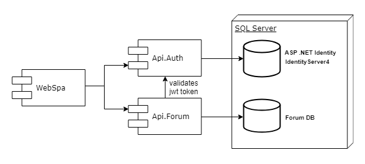
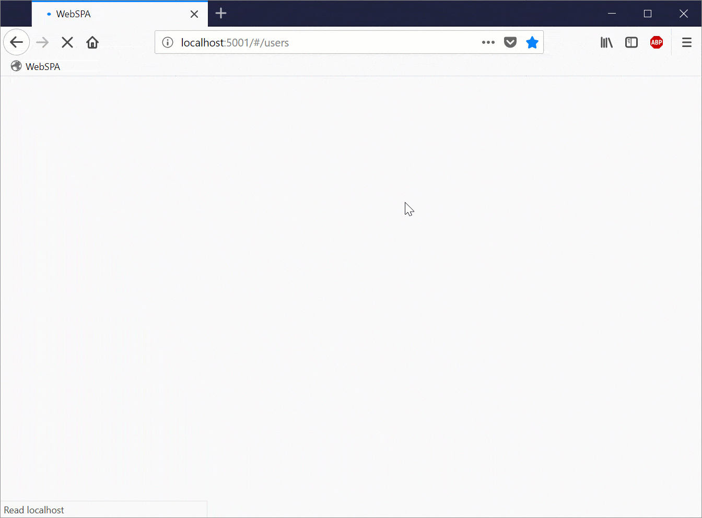

# Simple Forum SPA 

This is a simple Forum ASP .NET MVC Core SPA Web App written to play around with [IdentityServer4](http://docs.identityserver.io/en/release/). Particularly, making the native ASP.NET Core __Identity__ system play along with the IdentityServer4 STS hosted in a separate service, and making it all work with an Angular SPA client app all together.

## Overview
The forum allows to create/modify/delete threads and ceate replies to threads depending on user's role.
There're three user roles: user, moderator, admin.
>Note: there's no guest role, so users that are not logged-in can't see forum threads at all.

| Role     |  Read  | Edit  | Delete | Reply |
|----------|:------:|:-----:|:------:|:-----:|
| guest    |   NO   |  NO   |   NO   |  NO   |
| user     |   YES  |  NO   |   NO   |  YES  |
| moderator|   YES  |  YES  |   NO   |  YES  |
| admin    |   YES  |  YES  |   YES  |  YES  |

The solution consists of 3 services:
* WebSPA - A SPA app written in angular.
* Api.Auth - An ASP .NET webservice responsible for authentication/authorization. Uses IdenttityServer4 to issue/verify JWT tokens. Has Login/Register web forms (Razor). Also has a REST service to give away the list of all users and their roles to be deisplayed in WebSPA.
* Api.Forum - A WebApi with CRUD to manage threads/replies. The access to the API is regulated by roles. 

Api.Auth and Api.Forum create their own databases in a local MS SQL Server DBMS instance. 
`SimpleForum-Api.Auth-v1` and `SimpleForum-Api.Forum-v1` correspondingly.


| Service    |  Binding               | In Docker              |
|------------|:---------------------- |:-----------------------|
|  WebSPA    |  http://localhost:5001 |  http://WebSPA:5001    |
|  Api.Auth  |  http://localhost:5002 |  http://api.auth:5002  |
|  Api.Forum |  http://localhost:5003 |  http://api.forum:5003 |
| sql.server |  (localdb)             |  test.sql.server,1433  |

When running on host machine it will use the local __LocalDB__ instance. And when in Docker, it will utilize a separate `mssql-server-linux` container.



## Disclaimer
This project is a sole playground which is not intended to be published anywhere. So, not the SPA part nor the .NET code contain proper configuration to be built for production. Even the docker containers that run the services are based on `dotnet:2.1-sdk` which is not intended for any kind of production.
Also, there is no token expiration/renewal handling. 

## Prerequisites
+ [Docker for Windows](https://www.docker.com/docker-windows)
+ [ASP .NET Core SDK 2.1.preview-2](https://blogs.msdn.microsoft.com/dotnet/2018/04/11/announcing-net-core-2-1-preview-2/)
+ [Node.Js](https://nodejs.org/en/)
+ [LocalDB](https://docs.microsoft.com/en-us/sql/database-engine/configure-windows/sql-server-2016-express-localdb?view=sql-server-2017)

## Known Issues
+ `angular2-logger` problem when building with Angular5. [Fix is to delete ts files from npm package](https://github.com/code-chunks/angular2-logger/issues/175)
```
ERROR in ./node_modules/angular2-logger/app/core/level.ts
Module build failed: Error: xyz\node_modules\angular2-logger\app\core\level.ts is missing from the TypeScript compilation. Please make sure it is in your tsconfig via the 'files' or 'include' property.
The missing file seems to be part of a third party library. TS files in published libraries are often a sign of a badly packaged library. Please open an issue in the library repository to alert its author and ask them to package the library using the Angular Package Format (https://goo.gl/jB3GVv).
```
+ Nevermind the errors like these. These are actually npm warnings that .net wrongfully displays as errors.
```
 [Error] Microsoft.AspNetCore.SpaServices
         on line 10 of node_modules/bootstrap/scss/mixins/_text-hide.scss, in mixin `text-hide`
```

## Preview


## Usage

### From console
```CMD
.\StartAll.ps1
```

This will spawn three new console procesess each running an instance of a microservice (Api.Auth, Api.Forum and WebSpa) hosted in Kastrel (withouth integration with IIS).
>Note: when running on the host windows system SimpleForum will use a local instance of __LocalDB__. See connection strings.

### From Docker
Switch into the `Linux` mode.
From the solution's root folder execute:
```
docker-compose build
docker-compose up 
```
And open `http://localhost:5001` in your browser.
>Note1: Even when running in docker, it will expose services to `localhost`, so ports 5001-5003 are expected to be vacant on the host machine.

>Note2: Even thouth the soulution utilizes Docker, the containers themselves has nothing to do with deployment. It's only a playground.

### From Visual Studio 15
+ By activating the "Multiple Startup Projects" option in the solution's properties.
+ Starting the `docker-compose` project.

### Angular-cli
It is possible to run SPA part outside the dotnet host (without running WebSPA.csproj). 
For that simply: 
```
cd .\WebSPA\ClientApp

npm install copyfiles -g
npm install -g @angular/cli

npm ng:prestart
npm ng:start
```
>Note: You need the latest version of `nodeJS` installed on your machine in order to use `npm`.

## License

This project is licensed under the [MIT license](LICENSE).
